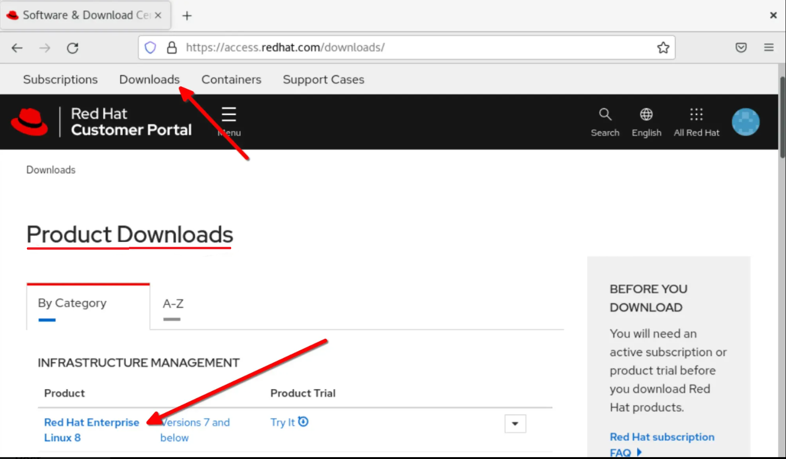
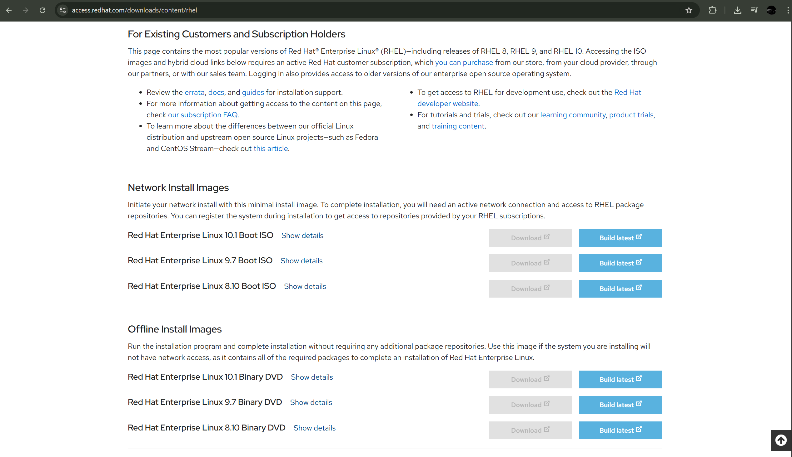
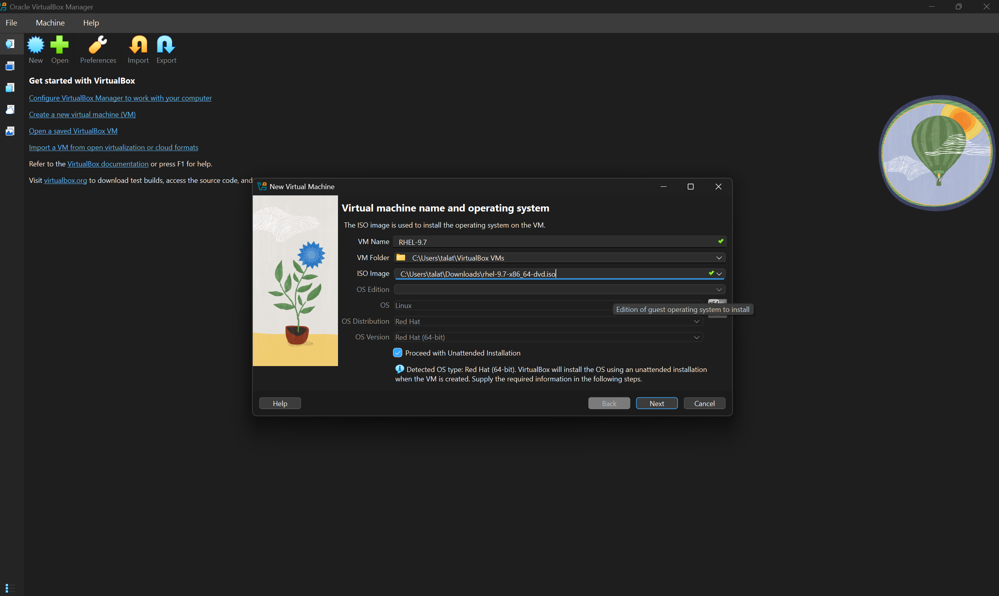

# How to Download Red Hat Enterprise Linux (RHEL) 9.2

## 📌 Overview

> ⚠️ RHEL requires a free Red Hat account. This guide explains that process clearly.

---

## 🎯 Who This Guide Is For

* Students learning Linux or system administration
* Beginners installing RHEL for labs or practice
* Users confused by Red Hat’s subscription process

---

## 🧾 Prerequisites

Before downloading RHEL 9.2, make sure you have:

* A valid email address
* Internet connection
* At least **20 GB disk space** for installation
 
## 📥 Step‑by‑Step Download Instructions

### 1️⃣ Create a Free Red Hat Account

1. Go to the official Red Hat website
2. Click **Register**
3. Create a **free developer account** (no payment required)
 
---

### 2️⃣ Log In to Red Hat Customer Portal

* Sign in using the account you just created

---

### 3️⃣ Navigate to RHEL Downloads

1. Go to **Products → Red Hat Enterprise Linux**
2. Select **Version 9.2**
3. Choose your architecture (usually **x86_64**)
 
---

### 4️⃣ Download the ISO File

* Click **Download ISO**
* File size is ~8 GB
* Wait for the download to complete

 
---

## Download is free and paid

* The **Developer Subscription** is free for personal use
* RHEL can be installed on virtual machines (VMware, VirtualBox)
* Keep your Red Hat account details safe for future updates

 
