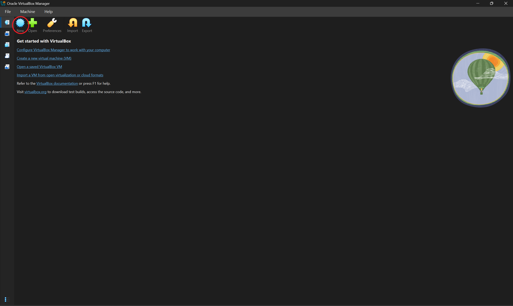
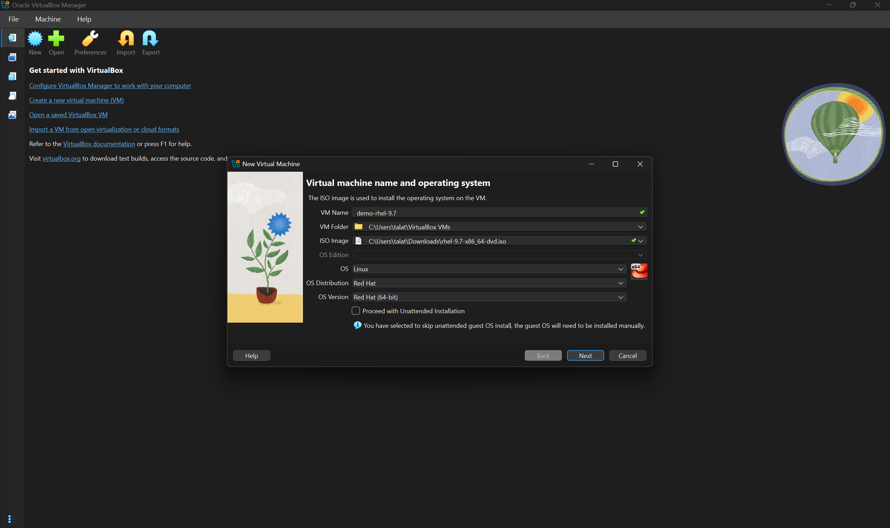
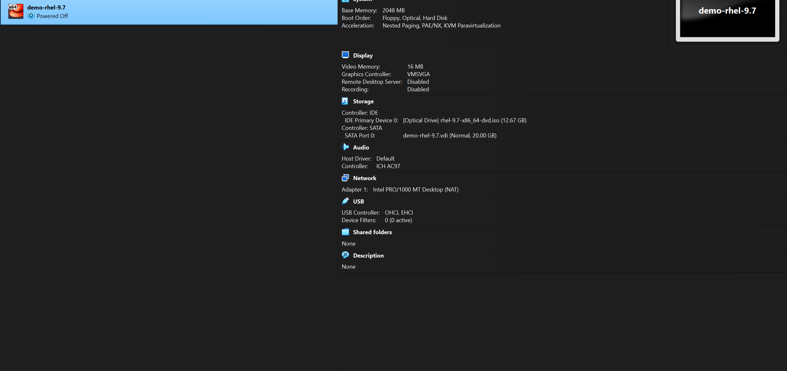

# How to create VM using Red Hat Enterprise Linux (RHEL) 9.2

## Overview

>  RHEL requires a free Red Hat account. This guide explains that process clearly.

### 1 Create a Free Red Hat Account

1. Go to the VM
2. Click New
3. Create a Linux Vm
 
---

### 2️ Log In to Red Hat Customer Portal

* Add the iso and the folder

---

### 3️ Navigate to RHEL Downloads

1. Now click Next
2. Select **Version 9.2**
3. Choose your architecture (usually **x86_64**) and then create

  

 
---

## Download is free and paid

* The **Developer Subscription** is free for personal use
* RHEL can be installed on virtual machines (VMware, VirtualBox)
* Keep your Red Hat account details safe for future updates

 
